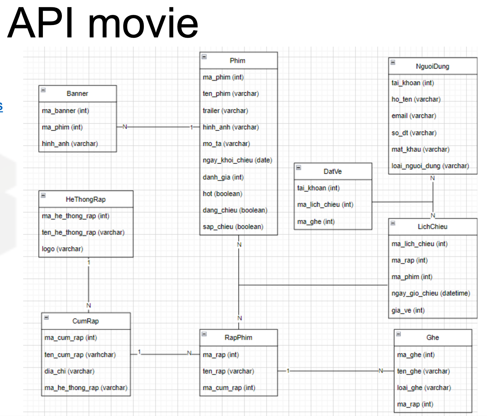

# Dự án Quản lý Rạp chiếu phim

## Mô tả

Đây là một dự án backend sử dụng NestJS để xây dựng API cho hệ thống quản lý rạp chiếu phim. Dự án bao gồm các chức năng như quản lý người dùng, quản lý phim, quản lý rạp chiếu và đặt vé.

## Công nghệ sử dụng

- NestJS: Framework chính để xây dựng ứng dụng
- TypeScript: Ngôn ngữ lập trình
- Prisma: ORM để tương tác với cơ sở dữ liệu
- JWT (JSON Web Tokens): Xác thực và phân quyền
- bcrypt: Mã hóa mật khẩu
- Swagger: Tạo tài liệu API
- Multer: Xử lý upload file
- class-validator: Xác thực dữ liệu đầu vào

## Cài đặt

1. Clone repository
2. Cài đặt dependencies:
   ```
   yarn install
   ```
3. Cấu hình biến môi trường trong file .env
4. Chạy migration Prisma:
   ```
   yarn prisma db pull
   ```
   yarn prisma generate
   ```
5. Chạy ứng dụng:
   ```
   yarn run start:dev
   ```

## Cấu trúc dự án

Dự án được tổ chức thành các module chính:

- UserModule: Quản lý người dùng
- MovieManagementModule: Quản lý phim
- TheaterModule: Quản lý rạp chiếu
- BookingModule: Quản lý đặt vé

## API Endpoints

### 1. Quản lý Người dùng (QuanLyNguoiDung)

Base URL: `/api/QuanLyNguoiDung`

#### 1.1. Đăng ký
- **Phương thức:** POST
- **Đường dẫn:** `/DangKy`
- **Mô tả:** Đăng ký tài khoản mới
- **Body:** InfoUser
- **Xác thực:** Không cần

#### 1.2. Đăng nhập
- **Phương thức:** POST
- **Đường dẫn:** `/DangNhap`
- **Mô tả:** Đăng nhập vào hệ thống
- **Body:** InfoLogin
- **Xác thực:** Không cần

#### 1.3. Lấy danh sách người dùng
- **Phương thức:** GET
- **Đường dẫn:** `/LayDanhSachNguoiDung`
- **Mô tả:** Lấy danh sách tất cả người dùng
- **Xác thực:** JWT

#### 1.4. Lấy danh sách người dùng phân trang
- **Phương thức:** GET
- **Đường dẫn:** `/LayDanhSachNguoiDungPhanTrang`
- **Mô tả:** Lấy danh sách người dùng có phân trang
- **Query params:** ListUserPaginatedDto
- **Xác thực:** JWT

#### 1.5. Tìm kiếm người dùng
- **Phương thức:** GET
- **Đường dẫn:** `/TimKiemNguoiDung`
- **Mô tả:** Tìm kiếm người dùng theo từ khóa
- **Query params:** tuKhoa
- **Xác thực:** JWT

#### 1.6. Xóa người dùng
- **Phương thức:** DELETE
- **Đường dẫn:** `/XoaNguoiDung`
- **Mô tả:** Xóa người dùng theo tài khoản
- **Query params:** taiKhoan
- **Xác thực:** JWT

#### 1.7. Lấy thông tin tài khoản
- **Phương thức:** GET
- **Đường dẫn:** `/ThongTinTaiKhoan`
- **Mô tả:** Lấy thông tin chi tiết của tài khoản đang đăng nhập
- **Xác thực:** JWT

#### 1.8. Cập nhật thông tin người dùng
- **Phương thức:** PUT
- **Đường dẫn:** `/CapNhatThongTinNguoiDung`
- **Mô tả:** Cập nhật thông tin người dùng
- **Body:** UpdateUserDto
- **Xác thực:** JWT

### 2. Quản lý Đặt vé (QuanLyDatVe)

Base URL: `/api/QuanLyDatVe`

#### 2.1. Lấy danh sách phòng vé
- **Phương thức:** GET
- **Đường dẫn:** `/LayDanhSachPhongVe`
- **Mô tả:** Lấy thông tin phòng vé theo mã lịch chiếu
- **Query params:** maLichChieu
- **Xác thực:** JWT

#### 2.2. Đặt vé
- **Phương thức:** POST
- **Đường dẫn:** `/DatVe`
- **Mô tả:** Đặt vé xem phim
- **Body:** BookingDto
- **Xác thực:** JWT

#### 2.3. Tạo lịch chiếu
- **Phương thức:** POST
- **Đường dẫn:** `/TaoLichChieu`
- **Mô tả:** Tạo lịch chiếu mới
- **Body:** ShowtimesDto
- **Xác thực:** JWT

### 3. Quản lý Rạp (QuanLyRap)

Base URL: `/api/QuanLyRap`

#### 3.1. Lấy thông tin hệ thống rạp
- **Phương thức:** GET
- **Đường dẫn:** `/LayThongTinHeThongRap`
- **Mô tả:** Lấy thông tin hệ thống rạp
- **Query params:** maHeThongRap (không bắt buộc)
- **Xác thực:** JWT

#### 3.2. Lấy thông tin cụm rạp theo hệ thống
- **Phương thức:** GET
- **Đường dẫn:** `/LayThongTinCumRapTheoHeThong`
- **Mô tả:** Lấy thông tin cụm rạp theo mã hệ thống rạp
- **Query params:** maHeThongRap
- **Xác thực:** JWT

#### 3.3. Lấy thông tin lịch chiếu hệ thống rạp
- **Phương thức:** GET
- **Đường dẫn:** `/LayThongTinLichChieuHeThongRap`
- **Mô tả:** Lấy thông tin lịch chiếu của tất cả hệ thống rạp
- **Xác thực:** JWT

#### 3.4. Lấy thông tin lịch chiếu phim
- **Phương thức:** GET
- **Đường dẫn:** `/LayThongTinLichChieuPhim`
- **Mô tả:** Lấy thông tin lịch chiếu của một phim cụ thể
- **Query params:** maPhim
- **Xác thực:** JWT

### 4. Quản lý Phim (QuanLyPhim)

Base URL: `/api/QuanLyPhim`

#### 4.1. Lấy danh sách banner
- **Phương thức:** GET
- **Đường dẫn:** `/LayDanhSachBanner`
- **Mô tả:** Lấy danh sách banner
- **Xác thực:** JWT

#### 4.2. Lấy danh sách phim
- **Phương thức:** GET
- **Đường dẫn:** `/LayDanhSachPhim`
- **Mô tả:** Lấy danh sách tất cả phim
- **Xác thực:** JWT

#### 4.3. Lấy danh sách phim phân trang
- **Phương thức:** GET
- **Đường dẫn:** `/LayDanhSachPhimPhanTrang`
- **Mô tả:** Lấy danh sách phim có phân trang
- **Query params:** GetListMoviePaginate
- **Xác thực:** JWT

#### 4.4. Lấy danh sách phim theo ngày
- **Phương thức:** GET
- **Đường dẫn:** `/LayDanhSachPhimTheoNgay`
- **Mô tả:** Lấy danh sách phim theo khoảng thời gian
- **Query params:** GetListMovieByDate
- **Xác thực:** JWT

#### 4.5. Lấy thông tin phim
- **Phương thức:** GET
- **Đường dẫn:** `/LayThongTinPhim`
- **Mô tả:** Lấy thông tin chi tiết của một phim
- **Query params:** maPhim
- **Xác thực:** JWT

#### 4.6. Thêm phim mới
- **Phương thức:** POST
- **Đường dẫn:** `/ThemPhimUploadHinh`
- **Mô tả:** Thêm phim mới với hình ảnh
- **Body:** UploadDTO
- **Xác thực:** JWT

#### 4.7. Xóa phim
- **Phương thức:** DELETE
- **Đường dẫn:** `/XoaPhim`
- **Mô tả:** Xóa phim theo mã phim
- **Query params:** maPhim
- **Xác thực:** JWT

#### 4.8. Cập nhật phim
- **Phương thức:** PUT
- **Đường dẫn:** `/CapNhatPhimUpload`
- **Mô tả:** Cập nhật thông tin phim
- **Body:** UpdateMovieDto
- **Xác thực:** JWT

## Xác thực

Tất cả các endpoint (ngoại trừ đăng ký và đăng nhập) đều yêu cầu xác thực JWT. Token JWT cần được gửi trong header của request dưới dạng Bearer token.

## Swagger Documentation

API được tài liệu hóa sử dụng Swagger.


